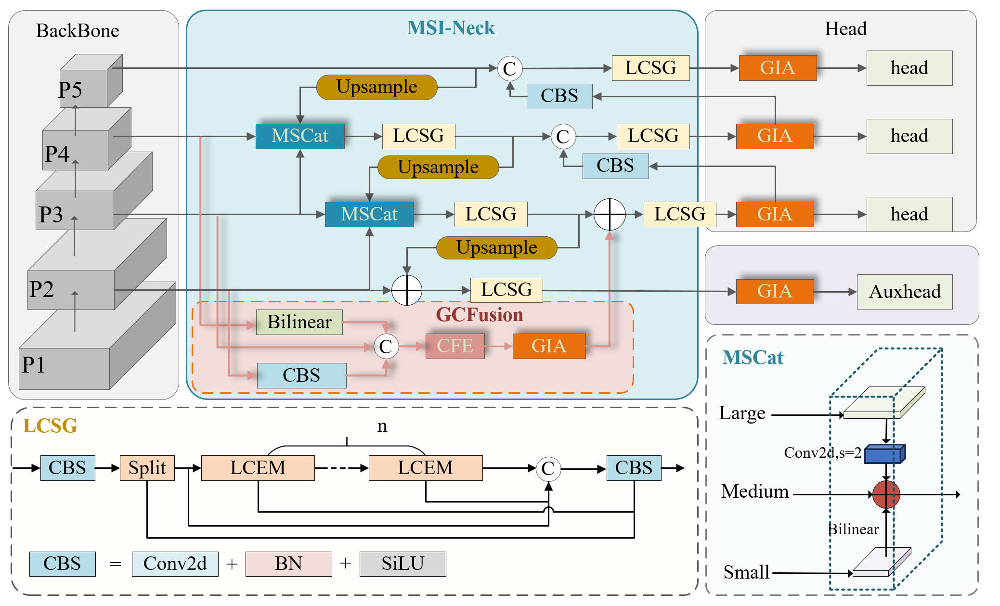

# LMG-YOLO

## Introduction
This is an enhanced version of YOLOv11, developed based on the paper "Enhanced YOLOv11 for Button Cell Battery Defect Detection: Leveraging Local Channel Semantic Guidance and Multi-Scale Interaction". It is used for detecting defects in button cell batteries. The model leverages local channel semantic guidance and multi-scale interaction to improve detection performance.

## Architecture Diagram
You can view the system architecture diagram here: 

## Setup

Before you begin, make sure to install the necessary dependencies:

```bash
pip install ultralytics
Usage
Train the Model

Run the following command to start training:

bash
python train.py
Test the Model

Run the following command to test the trained model:

bash
python val.py
Description
This project provides efficient detection of defects in button cell batteries, enabling fast and accurate identification of defects in complex environments.
